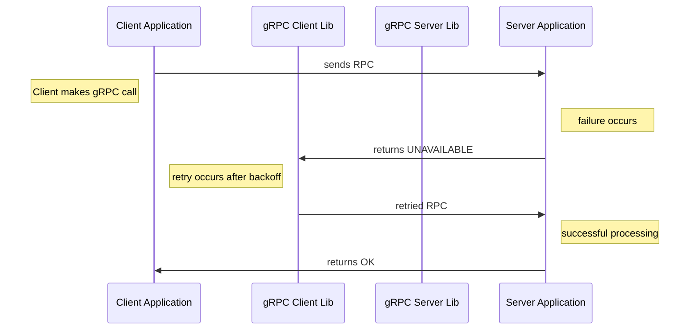
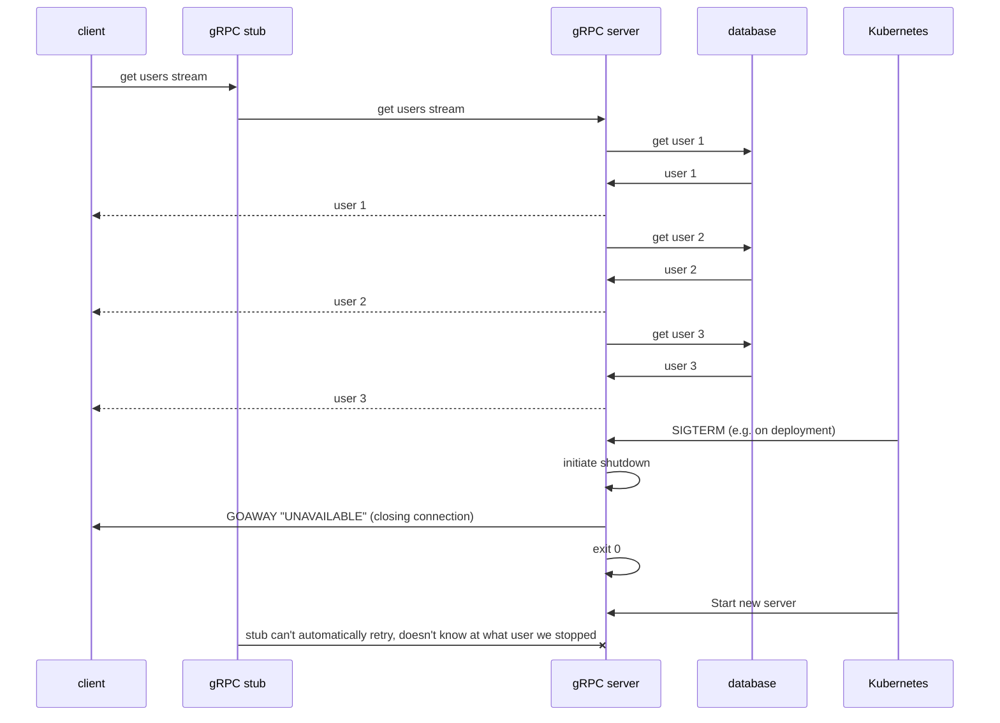

# gRPC retry mechanisms in go
My first ever talk I held at the [Bärner Go Talks 2023 no. 3](https://www.meetup.com/berner-go-meetup/events/293782118/) 
about gRPC and retry mechanisms in go.

## gRPC in general

## gRPC retry mechanisms
Read more on this [here](https://pkg.go.dev/google.golang.org/grpc/examples/features/retry#section-readme) and [here](https://github.com/grpc/proposal/blob/master/A6-client-retries.md).

gRPC supports client side retries but they are disabled by default and must be configured with a so called [service config](https://github.com/grpc/grpc/blob/master/doc/service_config.md).

### unary RPCs

### streaming RPCs

TL;DR: streaming RPC’s can’t be retried automatically.
