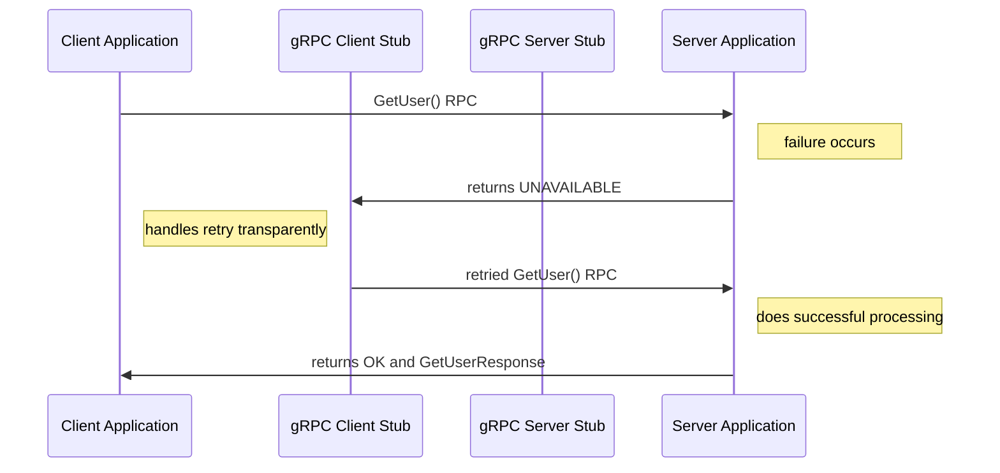
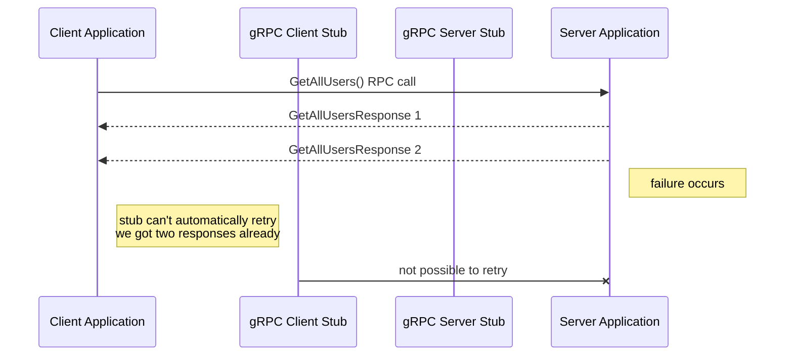

# gRPC retry mechanisms in go
My first ever talk I held at the [Bärner Go Talks 2023 no. 3](https://www.meetup.com/berner-go-meetup/events/293782118/) 
about gRPC and retry mechanisms in go.

## gRPC in general
Have a look at the slides I made for the talk [here](https://docs.google.com/presentation/d/1nWdZv9fzuEldlsOQKqtgBQSWuKpFnr-cZkGPGxQe4a0/edit?usp=sharing).

## gRPC retry mechanisms
You can read more on retries in the  [gRPC Retry Design document](https://github.com/grpc/proposal/blob/master/A6-client-retries.md) and in the [gRPC examples](https://pkg.go.dev/google.golang.org/grpc/examples/features/retry#section-readme).

gRPC supports client side retries, but they are disabled by default and must be configured with a so-called [service config](https://github.com/grpc/grpc/blob/master/doc/service_config.md).
The fields of the service config are defined by the [grpc.service_config.ServiceConfig](https://github.com/grpc/grpc-proto/blob/master/grpc/service_config/service_config.proto) 
protocol buffer message. Internally, gRPC uses the service config in JSON form. The JSON representation is the result of 
converting the protobuf form into JSON using the normal [protobuf to JSON translation rules](https://protobuf.dev/programming-guides/proto3/#json).

### unary RPCs
Request flow for a unary RPC in case a retry is triggered. As you can see in the diagram, the client stub will retry the
RPC this means that retry is transparent to the client application. The client application will only see the final result
of the RPC. The client stub will retry the RPC until it either succeeds or the retry budget is exhausted. The retry budget
is defined by the service config. 

### streaming RPCs
As you can see in the diagram below things look a bit different for streaming RPCs. The client stub will not retry the RPC
automatically. This means that the client application will see the failure and has to decide if it wants to retry the RPC.
The client application also needs to decide if it wants to start at the beginning of the stream or if it wants to continue
where it left off (if supported!).

If you're asking yourself why the client stub can't retry the RPC automatically, just ask yourself these questions:
* The client stub already received two responses and passed them to the client application. How does the client behave if
  the client stub retries the RPC and the client application receives the same responses again?
* How can the client stub retry the RPC if the server does not support starting the stream from an arbitrary point?
* Does it always make sense to start a stream from the beginning? 

